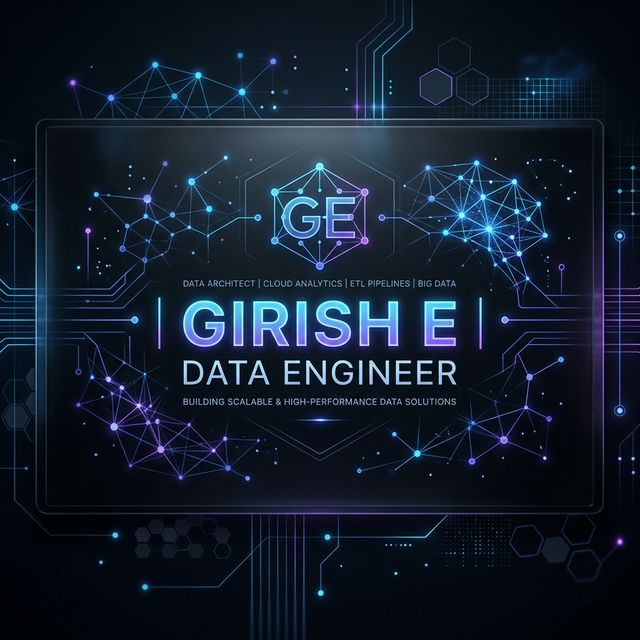

# Girish E — Data Engineering Portfolio

> A premium, highly-optimized responsive personal portfolio crafted for the Modern Data Stack and Agentic AI landscape.



## 🌟 Overview

This repository contains the source code for my elite data engineering and analytics portfolio. Designed from the ground up to reflect precision and modern aesthetics, the entire architecture leverages a custom **Glassmorphism Dark Mode** CSS engine and deep JavaScript interactivity—featuring intersection-observer-driven animations, real-time GitHub repository fetching, and curated Data Stack blogging.

## 🚀 Key Features

- **6-Section Single Page Architecture**: Completely responsive layouts mapped seamlessly to About, Resume, Projects, Blog, Achievements, and Contact arrays.
- **Micro-Animated Glassmorphism System**: Hand-coded semantic HTML and pure CSS utilizing backdrop-filters, custom properties, and glowing border gradients to deliver an ultra-premium visual experience.
- **Live Tech Ecosystem Arrays**:
  - Live GitHub API dynamic data fetching mapped to color-coded languages.
  - Interactive timeline syncing 10M+ daily record ETL achievements across Databricks and Airflow.
  - Curated, live LinkedIn carousels bridging System Design and Advanced Agentic Automation into custom components.
- **Deep Technical SEO**: Integrated seamlessly with strictly compliant `sitemap.xml`, `robots.txt`, and Open Graph & Twitter meta endpoints. Full `schema.org/Person` JSON-LD configuration enables highly-indexed rich snippets alongside Google Analytics tracking.

## 💻 Tech Stack

- **Frontend**: HTML5, Vanilla JavaScript (ES6+), Vanilla CSS (Custom Variables, Flexbox, CSS Grid)
- **APIs**: GitHub REST API (Live Portfolio Sync), Formspree (AJAX Contact Delivery Form)
- **Deployment**: GitHub Pages (Static Hosting)
- **Tracking**: Google Analytics 4

## 🔧 Structure

```
├── index.html          # Core document structure & SEO configuration
├── sitemap.xml         # XML SEO map for major search engine crawlers
├── robots.txt          # Crawler instructions
├── assets/
│   ├── css/
│   │   └── style.css   # Main design system & glassmorphism architecture
│   ├── js/
│   │   ├── script.js   # Interactivity, GSAP logic, and Github API logic
│   │   └── blog-data.js# High-performance static array powering the Blog 
│   ├── images/         # Compressed avatars, og-images, and generated favicons
│   └── Girish_E_Resume.pdf
└── README.md
```

## 👋 Connect With Me

- **LinkedIn**: [linkedin.com/in/girish02](https://www.linkedin.com/in/girish02/)
- **Website**: [girishdataprofessional.github.io](https://girishdataprofessional.github.io/)

---
*Built with precision and deep data orchestration.*
